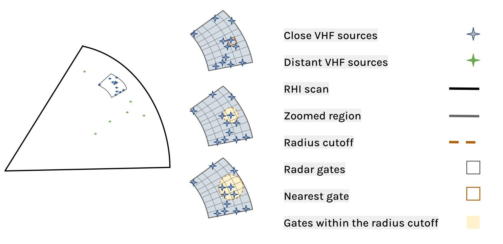

This code is used for obtaining the results on J. Souza and E. Bruning, Observations of the influence of turbulence on lightning initiation and propagation submitted to Geophysical Reserach Letters. 

It combines radar and lightining data into the same framework allowing to retrieve radar detected and derived fields where lightning flash propagated through the radar scan.

Getting the dataset
--------

The radar data is available on DOI: 10.5281/zenodo.4515064 and the lightining data is on DOI: 10.5281/zenodo.4509546 . The radar folder contains TTU Ka-band RHI scans for storms occurred during the spring and summer of 2015 - 2016 in the South Plains of the Texas Caprock. The files were processed in NetCDF4 format by the KTaL field experiment members using [Py-ART](https://github.com/ARM-DOE/pyart). The lightning folder contains the LMA source data as events table in HDF5 format after applying the flash sorting process available in [lmatools](https://github.com/deeplycloudy/lmatools).

Getting the results
--------
The notebook [`analyze-results.ipynb`](analyze-results.ipynb) go through the steps to obtain the result tables using different interpolations: [`Nearest Neighbor`](turbulence_table_nearestneighbor.csv), [`Barnes 1`](turbulence_table_objectiveanalysis1.csv), [`Barnes 2`](turbulence_table_objectiveanalysis2.csv).

* Calculate EDR and velocity derivatives from initial dataset
* Find closest sources: intercepted location on the RHI scan

 
* Retrieve results: distance from flash initiation and radar measurements at interception

Example use case
--------
The notebook [`analyze-results.ipynb`](analyze-results.ipynb) shows with the results obtained by the previous steps how EDR and spatial velocity derivative varied with distance from flash initiation.

Dependencies
--------
 * NumPy
 * SciPy
 * Matplotlib
 * Pandas
 * Xarray
 * Cartopy
 * Shapely
 * [Py-ART](https://github.com/ARM-DOE/pyart)
 * [lmatools](https://github.com/deeplycloudy/lmatools)
 * [PyTDA](https://github.com/nasa/PyTDA)
 
